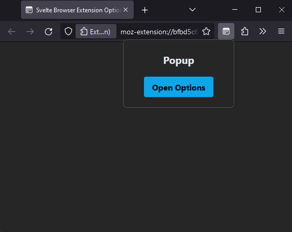
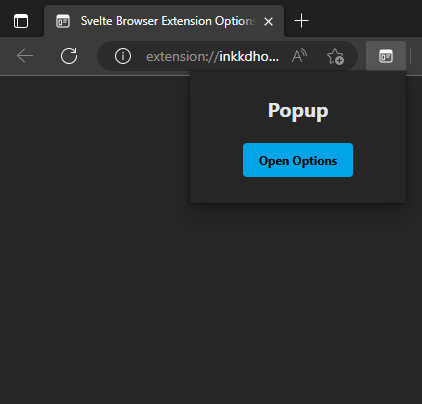

# svelte-extension-template

A template for creating browser extensions using:

- [Svelte](https://svelte.dev/)
- [Tailwind CSS](https://tailwindcss.com/)
- [TypeScript](https://www.typescriptlang.org/)
- [Vite](https://vitejs.dev/)

|                         Firefox                          |                         Chromium / Edge                         |
| :------------------------------------------------------: | :-------------------------------------------------------------: |
|  |  |

## Structure

It has two entry-points to create `Popup` and `Options` pages:

- `popup/index.html`
- `options/index.html`

By default, when running the dev server, it will launch the `/src/popup/index.html` page. Go to [this section](#modifying-dev-server-launch-page) to modify the run dev behavior.

## Usage

1. Clone the repository `git clone https://github.com/navorite/svelte-browser-extension-template.git`

2. Run `pnpm install`

3. Run `pnpm run watch` to start a dev server with HMR or `pnpm run build` to build for production

## Setup

### Creating or removing pages

1. Edit the build.input object inside Vite config

```
   //vite.config.ts
   input: {
       popup: fileURLToPath(
         new URL('./src/popup/index.html', import.meta.url)
       ),
       options: fileURLToPath(
         new URL('./src/options/index.html', import.meta.url)
       ),
     },
```

2. Insert entry-point/page by inserting `entry-point: path-to-page` pair inside the object.
   Ex: Adding an about page:

```
    //vite.config.ts
    input: {
        popup: fileURLToPath(
          new URL('./src/popup/index.html', import.meta.url)
        ),
        options: fileURLToPath(
          new URL('./src/options/index.html', import.meta.url)
        ),
        about: fileURLToPath(
          new URL('./src/about/index.html', import.meta.url)
        ),
      },
```

4. Create a `main.ts`, `index.html` and - optionally - `about.svelte` file in the `src/about` folder for the page similar to how it is done in `src/popup` folder and `src/options` folder.

### Creating or removing path aliases

1. Open `vite.config.ts`

2. Insert a path alias in resolve.alias obj using `'alias': resolve-relative-path-to-alias` key-value pair. Ex: `'$types': fileURLToPath(new URL('./src/lib/types', import.meta.url))`

3. Open `tsconfig.json` and add the alias contents there as well. Ex: for `@types` alias add `"$types/*": ["./src/lib/types/*"],` to the paths obj. This step is not required, it is only to let JS / TS know about the alias to stop showing errors.

Note: @types won't work, as tsconfig.ts uses this alias inside node_modules/@types

### Modifying dev server launch page

Open `vite.config.ts` file and edit `server.open` to the location you want the dev server to open by default.
